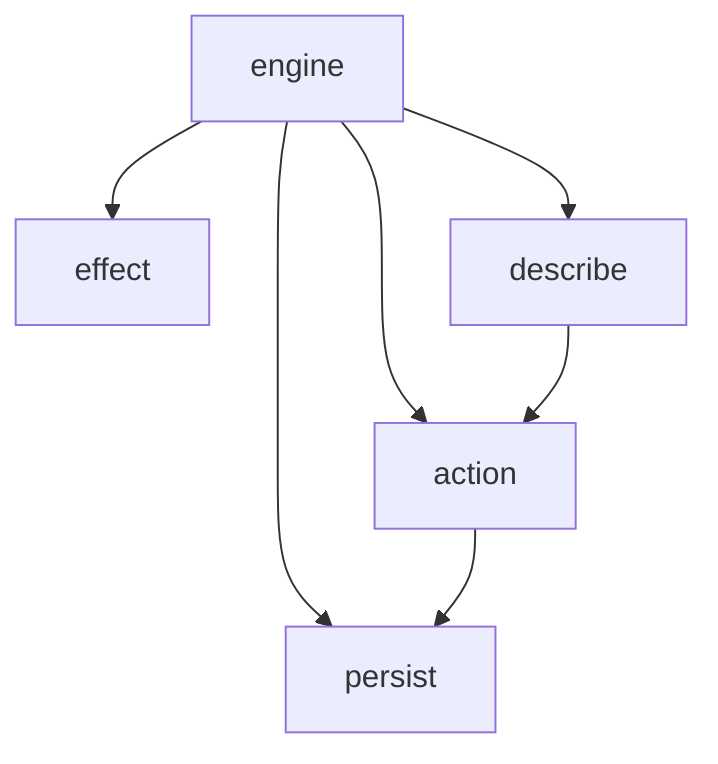

# ADR-0007: Split the engine into packages

- **Status:** Accepted
- **Date:** 2026-10-03
- **Deciders:** Aris Kurniawan
- **Supersedes:** section 1 of [ADR-0002](./0002-public-api.md) (root package `fate`)

## Context

Every engine file lived in the root package: 17 source files and 24 test files
in one folder. Nothing in the layout said which files were the runtime, which
were vocabulary for writing a machine, and which were tooling.

## Decision

The root package keeps only `Version`. The engine is split by concern:

| Package | Holds |
|---|---|
| `engine` | `Machine`, `Actor`, `Setup`, the config structs, node types, errors |
| `action` | `Action` and its constructors, `Guard` combinators, `Cond`, `CondMeta` |
| `effect` | `TimerID`, `PendingTimer`, `InvokeID`, `Invocation`, `PendingInvocation` |
| `persist` | `StateValue`, `Snapshot`, `ActorStatus`, `SnapshotVersion` |
| `describe` | `MachineDescriptor` and friends, `LoadDescriptor`, `UIState`, `UIStateOf` |

Go requires a type's methods to live in the type's package, so everything that
is a method of `Actor` or `Machine` stays in `engine`, whatever its concern:
`PendingTimers`, `FireTimer`, `ResolveInvocation`, `Persist`, `Describe`,
`UIState`, `IsLegalTransition`. The other packages hold the data types those
methods take and return.

The behavioural test suite moves to `engine/` with the types it drives.

## Consequences

- **Breaking.** Every `fate.X` becomes `engine.X`, `action.X`, `effect.X`,
  `persist.X` or `describe.X`. Symbol names are unchanged, so migration is a
  rename by the table above.
- Three members had to be exported because their callers are now in another
  package: `Action.Apply` (with the new `action.Sink`), `Cond.Matches`, and
  `CondMeta.Seal` / `CondMeta.Clone`. `Action` and `Cond` are therefore no
  longer closed to user implementations.
- `describe.UIState` gains `Valid` and `Eval` for the same reason.
- Coverage is counted across packages (`-coverpkg`), because the suite in
  `engine/` is what exercises `action`, `persist`, `effect` and `describe`.
- A machine definition now needs two imports (`engine` and `action`) where it
  needed one.
- The Temporal module pins a published engine tag, so it is untouched here and
  still uses the `fate.X` names of v0.5.1. It migrates in a follow-up once the
  root release containing this split is tagged. Until then it does not build
  against that release.
